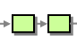
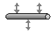
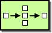
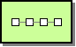
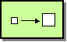
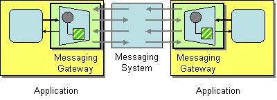
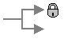

# EIP

Examples of implementing Enterprise Integration Patterns with UT

The examples are based on the pattern names defined by the
Enterprise Integration Patterns book and the site, which gives short description
of each patter. Here we give link to the pattern and the respective approach
within UT. They are described here, as many of the patterns can be implemented
within the script port, which among other goals, was created to serve this purpose.

Majority of the patterns are implemented in a few lines of JavaScript, without
any dependencies. In many cases we prefer this approach, instead of
involving complex libraries and class hierarchies, which are harder to
understand and may bring their hard to debug XML or DSL. By basing it on
JavaScript, developers doing the integration can choose their approach
and decide if they need any dependencies at all.

## [Messaging Systems](https://www.enterpriseintegrationpatterns.com/patterns/messaging/MessagingComponentsIntro.html)

### [Message channel](https://www.enterpriseintegrationpatterns.com/patterns/messaging/MessageChannel.html)


Within `UT`, ports are the equivalent of channels.
The script port is usually the place where EIP patterns
are often implemented.

Use `ut-function.dispatch` to easily create a script port:

```js
module.exports = function eip({
    import: {
        // list of external message handlers
    }
}) {
    return require('ut-function.dispatch')({
        async 'subject.object.predicate1'() {},
        async 'subject.object.predicate2'() {}
    })(...arguments);
};
```

### [Message](https://www.enterpriseintegrationpatterns.com/patterns/messaging/Message.html)


Messages in UT are the arguments of message handlers and result
returned from these handlers.
Usually there are two arguments, first being the
main message, and second being some metadata.
In case of more than two arguments, the last one is
always the metadata.

Handlers usually return a result and in some cases they
can modify the metadata object as per the needs.

Message metadata includes these properties:

- `mtid`- message type identifier, which can be one of:
  - `request` - for messages, which wait for a reply to be returned
  - `notification` - for messages, which do not wait for a reply
  - `response` - for messages, returned after successful execution of request
  - `error` - for messages, returned after unsuccessful execution of request
  - `event` - messages, generated by framework events
- `method`- identifies the name of the handler, which should process the message.
  The recommended way of naming the methods is in the form `subject.object.predicate`,
  which usually represent the following:
  - `subject` - identifies the module (i.e. channel/port), which handles the message.
  It is also used for name-spacing the API, splitting the application
  in microservices, etc.
  - `object` - identifies the entity, affected by the message
  - `predicate` - identifies the action applied on the `object`

  Similar approach is used in other places, where this is also named
  [semantic triple](https://en.wikipedia.org/wiki/Semantic_triple).
- `opcode` - has the same value as predicate, and has direct relationship
  with certain low level protocols, where messages have simple
- `trace` - unique identifier of the message within the context of
  the transmission protocol. This identifier is used to match replies
  (i.e. responses and errors) to their requests.

### [Pipes and Filters](https://www.enterpriseintegrationpatterns.com/patterns/messaging/PipesAndFilters.html)



Message processing can be split over several ports.
Each port can send a message to the next one
by calling a message handler. The message handlers of
the other ports can be accessed by by destructuring
the `import` property.

Send messages to other channels / ports by calling
imported handlers, which are async functions:

```js
module.exports = function pipes({
    import: {
        'subject.object.predicate': handler,
        subjectObjectPredicate // same method as above
    }
}) {
    return require('ut-function.dispatch')({
        async 'channel.message.send'(...params) {
            await handler(...params);
            await subjectObjectPredicate(...params); // same as above
        }
    })(...arguments);
};
```

### [Message Router](https://www.enterpriseintegrationpatterns.com/patterns/messaging/MessageRouter.html)


The default routing mechanism for messages is based on the
`subject` part of the method name. The framework utilizes `ut-bus`
to find the microservice containing the port, which can handle the message.
When the message cannot be handled within the current process, a
process known as service discovery is used. It usually involves
some logic on top of DNS.

### [Message Translator](https://www.enterpriseintegrationpatterns.com/patterns/messaging/MessageTranslator.html)

Translation of internal messages usually happens in the script
port, by writing JavaScript code. See examples in the section
[message transformation](#message-transformation) below.

Translation of messages to formats recognized by external systems
happens in what is known as `port` within UT framework. Here are
some examples of the most used ports within the framework:

- `ut-port-tcp` - for handling low level streams of network packets.
  It utilizes helper modules named `ut-codec-*` which convert messages
  between buffer and object representations.
- `ut-port-sql` - for interfacing to Microsoft SQL Server
- `ut-port-http` - for requesting HTTP servers using various HTTP based
  protocols

So the main difference is that `ut-port-script` is used for processing
of internal messages between other UT ports, while the rest of the ports
communicate with external systems.


### [Message Endpoint](https://www.enterpriseintegrationpatterns.com/patterns/messaging/MessageEndpoint.html)

Message endpoints are managed by `ut-bus`, which can be configured to
use different communication technologies. Each port creates
endpoint within `ut-bus` and depending on communication technology,
this can be represented in various ways, for example HTTP URL.


## [Messaging Channels](https://www.enterpriseintegrationpatterns.com/patterns/messaging/MessagingChannelsIntro.html)

### [Point-to-Point Channel](https://www.enterpriseintegrationpatterns.com/patterns/messaging/PointToPointChannel.html)


This is the default and most used mode, as it does not require
any additional configuration and is the easiest to use. Most of the ports
within UT framework work in point to point mode by just calling
their handlers, prefixed with the namespace of the port.

### [Publish-Subscribe Channel](https://www.enterpriseintegrationpatterns.com/patterns/messaging/PublishSubscribeChannel.html)

Publish-subscribe is not frequently used, as it requires persisting
of messages and usage of third party message queue software for message broker.
There are per demand efforts to support this in both the bus and
in specialized ports, but is not yet fully implemented. The potentially supported
message queues are IBM MQ, Rabbit MQ and Apache Kafka.

### [Datatype Channel](https://www.enterpriseintegrationpatterns.com/patterns/messaging/DatatypeChannel.html)

UT does not have any specific concept or recommendation for this pattern.

### [Invalid Message Channel](https://www.enterpriseintegrationpatterns.com/patterns/messaging/InvalidMessageChannel.html)

Currently this is not supported. Error logs are the place to check for invalid
messages, it the port implemented error logging of invalid messages.

### [Dead Letter Channel](https://www.enterpriseintegrationpatterns.com/patterns/messaging/DeadLetterChannel.html)


This is usually implemented in a message queue software, so it is not in
the scope of UT framework.

### [Guaranteed Delivery](https://www.enterpriseintegrationpatterns.com/patterns/messaging/GuaranteedMessaging.html)


Transparent persistence is usually implemented in a message queue software,
so it is not in the scope of UT framework. For explicit persistence,
ports like `ut-port-sql` or `ut-port-file` can be used.

### [Channel Adapter](https://www.enterpriseintegrationpatterns.com/patterns/messaging/ChannelAdapter.html)


Channel adapter within the UT framework is `ut-bus`. Ports use the bus API to
send and receive messages. The most used API method is `importMethod`, which
is used to send message to other ports. It is often conveniently provided in
the `import` property of the first argument of the function, which defines
the port, as shown in the section [Message Channel](#message-channel)

To be able to communicate to other messaging systems, in addition to `ut-bus`,
a port, which wraps the other messaging system API can also be used.
Examples of such ports are `ut-port-ibmmq` and `ut-port-rabbitmq`.

### [Messaging Bridge](https://www.enterpriseintegrationpatterns.com/patterns/messaging/MessagingBridge.html)

As described in the message patterns link above, the bridge is a set of adapters.


### [Message Bus](https://www.enterpriseintegrationpatterns.com/patterns/messaging/MessageBus.html)



UT framework components implement the idea of the message bus and at the same time
often there is no physical bus as such, `ut-bus` is closer to the concept of channel
adapter. In some circumstances `ut-bus` can be configured to create a network or
local socket, which is technically similar to the bus concept, but this is not often
used as it involves introducing a central message broker component.

## [Message Construction](https://www.enterpriseintegrationpatterns.com/patterns/messaging/MessageConstructionIntro.html)

### [Command Message](https://www.enterpriseintegrationpatterns.com/patterns/messaging/CommandMessage.html)

Command messages within UT are the messages with message type identifier (`mtid`)
equal to `request` or `notification`. They include the command to be invoked in
the `method` property in the metadata.

### [Document Message](https://www.enterpriseintegrationpatterns.com/patterns/messaging/DocumentMessage.html)

Examples of document message in UT are the messages with type identifier `error`
and `response`.

### [Event Message](https://www.enterpriseintegrationpatterns.com/patterns/messaging/EventMessage.html)


Event messages within UT have the type identifier `event`. Common events are:

- `start` - port was started
- `ready` - port is ready (connected)
- `stop` - port was stopped

Ports can implement event handlers and send messages to other ports or implement
other functionality if needed.

### [Request-Reply](https://www.enterpriseintegrationpatterns.com/patterns/messaging/RequestReply.html)


The result of the message handlers is returned to the calling port.

```js
module.exports = function requestReply() {
    return require('ut-function.dispatch')({
        async 'channel.message.return'(...params) {
            return {result: true}; // returned in the calling port
        }
    })(...arguments);
};
```

### [Return address](https://www.enterpriseintegrationpatterns.com/patterns/messaging/ReturnAddress.html)


UT implements the request reply pattern, where the return address is the
calling port by default.

### [Correlation Identifier](https://www.enterpriseintegrationpatterns.com/patterns/messaging/CorrelationIdentifier.html)


The framework uses the metadata property named `trace` to correlate messages in
point to point cases. Other data, related to distributed tracing can be present
in the `forward` property in the metadata. Code should always pass the metadata,
when calling other ports so that distributed tracing can work.

### [Message Sequence](https://www.enterpriseintegrationpatterns.com/patterns/messaging/MessageSequence.html)

There is no UT specific approach for message sequencing. A common use case is
paging through a big result set in reports, page number and page size are used
in the messaging.

### [Message Expiration](https://www.enterpriseintegrationpatterns.com/patterns/messaging/MessageExpiration.html)


The Message metadata includes a property named `timeout`. The value of this
property is one of:

- `integer` - when messages are serialized for sending over the network, this
  value indicates the number of milliseconds before the message is considered expired.
- `array of two integers` - when message is processed internally, the value represents
  the high-resolution real time in a [seconds, nanoseconds], until which the message
  is considered not expired. This value is specific to the process, where the message
  is handled. See [process.hrtime](https://nodejs.org/api/process.html#process_process_hrtime_time).
  for more details.

If the message represented a request, the framework will return error of type
`port.timeout` to the message sender if the timeout has passed.

### [Format Indicator](https://www.enterpriseintegrationpatterns.com/patterns/messaging/FormatIndicator.html)

There is no UT specific approach for the format indicator. Depending on
circumstances, it may be included in the message or message metadata.

## [Message Routing](https://www.enterpriseintegrationpatterns.com/patterns/messaging/MessageRoutingIntro.html)

### [Content Based Router](https://www.enterpriseintegrationpatterns.com/patterns/messaging/ContentBasedRouter.html)


```js
module.exports = function contentRouter({
    import: {
        subjectObjectPredicateA,
        subjectObjectPredicateB
    }
}) {
    return require('ut-function.dispatch')({
        'channel.message.route'({destination}) {
            return {
                case1: subjectObjectPredicateA,
                case2: subjectObjectPredicateB
            }[destination](...arguments);
        }
    })(...arguments);
};
```

### [Dynamic Router](https://www.enterpriseintegrationpatterns.com/patterns/messaging/DynamicRouter.html)


```js
module.exports = function dynamicRouter({import: external}) {
    return require('ut-function.dispatch')({
        'channel.message.dynamicRoute'({destination}) {
            return external[destination](...arguments);
        }
    })(...arguments);
};
```

### [Filter](https://www.enterpriseintegrationpatterns.com/patterns/messaging/Filter.html)


```js
module.exports = function filter({import: {subjectObjectPredicate}}) {
    return require('ut-function.dispatch')({
        'channel.message.filter'({condition}) {
            return condition && subjectObjectPredicate(...arguments);
        }
    })(...arguments);
};
```

### [Recipient List](https://www.enterpriseintegrationpatterns.com/patterns/messaging/RecipientList.html)


```js
module.exports = function recipientList({
    import: external,
    config: {
        recipients = [
            'subjectObjectPredicateA',
            'subjectObjectPredicateB'
        ]
    }
}) {
    return require('ut-function.dispatch')({
        'channel.message.sendParallel'() {
            return Promise.all(recipients.map(
                recipient => external[recipient](...arguments)
            ));
        },
        async 'channel.message.sendSequential'() {
            const result = [];
            for (const recipient of recipients) {
                result.push(
                    await external[recipient](...arguments)
                );
            }
            return result;
        }
    })(...arguments);
};
```

### [Splitter](https://www.enterpriseintegrationpatterns.com/patterns/messaging/Sequencer.html)


```js
module.exports = function splitter({import: {subjectObjectPredicate}}) {
    return require('ut-function.dispatch')({
        'channel.message.splitParallel': ({items}, ...rest) =>
            Promise.all(items.map(
                item => subjectObjectPredicate(item, ...rest)
            )),
        async 'channel.message.splitSequential'({items}, ...rest) {
            const result = [];
            for (const item of items) {
                result.push(
                    await subjectObjectPredicate(item, ...rest)
                );
            }
            return result;
        }
    })(...arguments);
};
```

### [Aggregator](https://www.enterpriseintegrationpatterns.com/patterns/messaging/Aggregator.html)


```js
module.exports = function aggregator({
    import: {subjectObjectPredicate},
    config: {
        size = 10,
        list = [],
        strategy = {
            aggregate: message => list.push(message),
            complete: () => (list.size >= size) && list.splice(0, list.size)
        }
    }
}) {
    return require('ut-function.dispatch')({
        'channel.message.aggregate'(message, ...rest) {
            strategy.aggregate(message);
            const aggregate = strategy.complete();
            return aggregate && subjectObjectPredicate(aggregate, ...rest);
        }
    })(...arguments);
};
```

### [Resequencer](https://www.enterpriseintegrationpatterns.com/patterns/messaging/Resequencer.html)


```js
module.exports = function resequencer({
    import: {subjectObjectPredicate},
    config: {
        size = 10,
        comparator = (first, second) => first[0].order - second[0].order,
        list = [],
        strategy = {
            aggregate: message => list.push(message),
            complete: () => (list.size >= size) &&
                list
                    .splice(0, list.size)
                    .sort(comparator)
        }
    }
}) {
    return require('ut-function.dispatch')({
        async 'channel.message.sort'(...params) {
            strategy.aggregate(...params);
            const aggregate = strategy.complete() || [];
            const result = [];
            for (const item of aggregate) {
                result.push(await subjectObjectPredicate(...item));
            }
            return result;
        }
    })(...arguments);
};
```

### [Composer](https://www.enterpriseintegrationpatterns.com/patterns/messaging/DistributionAggregate.html)



```js
module.exports = function composer({
    import: {
        subjectObjectPredicateA,
        subjectObjectPredicateB
    }
}) {
    return require('ut-function.dispatch')({
        'channel.message.compose': async({part1, part2}, ...rest) => ({
            ...await subjectObjectPredicateA(part1, ...rest),
            ...await subjectObjectPredicateB(part2, ...rest)
        })
    })(...arguments);
};
```

### [Scatter Gatherer](https://www.enterpriseintegrationpatterns.com/patterns/messaging/BroadcastAggregate.html)


```js
module.exports = function scatterGatherer({import: external}) {
    return require('ut-function.dispatch')({
        async 'channel.message.scatter'({destinations, ...params}, ...rest) {
            const result = [];
            for (const destination of destinations) {
                result.push(
                    await external[destination](params, ...rest)
                );
            }
            return result;
        }
    })(...arguments);
};
```

### [Routing slip](https://www.enterpriseintegrationpatterns.com/patterns/messaging/RoutingTable.html)



### [Process manager](https://www.enterpriseintegrationpatterns.com/patterns/messaging/ProcessManager.html)


### [Message broker](https://www.enterpriseintegrationpatterns.com/patterns/messaging/MessageBroker.html)


### Throttler

### Sampler

### Delayer

### Load Balancer

### Circuit Breaker

### Service Call

### Saga

### Multi-cast

### Loop

## [Message Transformation](https://www.enterpriseintegrationpatterns.com/patterns/messaging/MessageTransformationIntro.html)

### [Envelope Wrapper](https://www.enterpriseintegrationpatterns.com/patterns/messaging/EnvelopeWrapper.html)


```js
const crypto = require('crypto');
module.exports = function envelopeWrapper({import: {subjectObjectPredicate}}) {
    return require('ut-function.dispatch')({
        'channel.message.wrap': async() =>
            Buffer.from(
                await subjectObjectPredicate({
                    payload: crypto.randomBytes(100).toString('base64')
                }),
                'base64'
            )
    })(...arguments);
};
```

### [Content Enricher](https://www.enterpriseintegrationpatterns.com/patterns/messaging/DataEnricher.html)



```js
module.exports = function contentEnricher({
    import: {
        subjectObjectPredicateA,
        subjectObjectPredicateB
    }
}) {
    let enrich; // cache the enrichment data
    return require('ut-function.dispatch')({
        namespace: 'channel',
        methods: {
            async start() {
                enrich = await subjectObjectPredicateA();
            },
            'channel.message.enrich': async(params, ...rest) =>
                subjectObjectPredicateB(
                    {params, ...enrich},
                    ...rest
                ),
            'channel.message.enrichConfig'(params, ...rest) {
                return subjectObjectPredicateB(
                    {params, ...this.config.enrich},
                    ...rest
                );
            }
        }
    })(...arguments);
};
```

### [Content Filter](https://www.enterpriseintegrationpatterns.com/patterns/messaging/ContentFilter.html)


```js
module.exports = function contentFilter({import: {subjectObjectPredicate}}) {
    return require('ut-function.dispatch')({
        'channel.message.simplify': ({skip, ...simple}, ...rest) =>
            subjectObjectPredicate(simple, ...rest)
    })(...arguments);
};
```

### [Claim Check](https://www.enterpriseintegrationpatterns.com/patterns/messaging/StoreInLibrary.html)


```js
module.exports = function claimCheck({
    import: {
        subjectObjectPredicateA,
        subjectObjectPredicateB
    }
}) {
    return require('ut-function.dispatch')({
        async 'channel.message.claim'(params, ...rest) {
            const {id} = await subjectObjectPredicateA(...arguments);
            return subjectObjectPredicateB({id}, ...rest);
        }
    })(...arguments);
};
```

### [Normalizer](https://www.enterpriseintegrationpatterns.com/patterns/messaging/Normalizer.html)


```js
module.exports = function normalizer({
    import: {subjectObjectPredicate},
    config: {
        detect = params => params.format,
        formats = {
            buffer: value => value.toString('base64'),
            date: value => value.toISOString(),
            default: value => value.toString()
        }
    }
}) {
    return require('ut-function.dispatch')({
        'channel.message.normalize': (params, ...rest) =>
            subjectObjectPredicate(
                (formats[detect(params)] || formats.default)(params),
                ...rest
            )
    })(...arguments);
};
```

### [Canonical data model](https://www.enterpriseintegrationpatterns.com/patterns/messaging/CanonicalDataModel.html)

```js
const joi = require('joi');
module.exports = function validation() {
    return {
        'channel.message.filter': () => ({
            description: 'Message filter EIP',
            params: joi.object().keys({
                condition: joi
                    .boolean()
                    .required()
                    .description('Filtering condition')
            }),
            result: joi.object()
        })
    };
};
```

## [Messaging endpoints](https://www.enterpriseintegrationpatterns.com/patterns/messaging/MessagingEndpointsIntro.html)

### [Messaging Gateway](https://www.enterpriseintegrationpatterns.com/patterns/messaging/MessagingGateway.html)



### [Message Mapper](https://www.enterpriseintegrationpatterns.com/patterns/messaging/MessagingMapper.html)

### [Transactional Client](https://www.enterpriseintegrationpatterns.com/patterns/messaging/TransactionalClient.html)


### [Polling Consumer](https://www.enterpriseintegrationpatterns.com/patterns/messaging/PollingConsumer.html)


### [Event Driven Consumer](https://www.enterpriseintegrationpatterns.com/patterns/messaging/EventDrivenConsumer.html)


### [Competing Consumers](https://www.enterpriseintegrationpatterns.com/patterns/messaging/CompetingConsumers.html)


### [Message Dispatcher](https://www.enterpriseintegrationpatterns.com/patterns/messaging/MessageDispatcher.html)


### [Selective Consumer](https://www.enterpriseintegrationpatterns.com/patterns/messaging/MessageSelector.html)


### [Durable Subscriber](https://www.enterpriseintegrationpatterns.com/patterns/messaging/DurableSubscription.html)



### [Idempotent Receiver](https://www.enterpriseintegrationpatterns.com/patterns/messaging/IdempotentReceiver.html)

### [Service Activator](https://www.enterpriseintegrationpatterns.com/patterns/messaging/MessagingAdapter.html)


## [System Management](https://www.enterpriseintegrationpatterns.com/patterns/messaging/SystemManagementIntro.html)

### [Control Bus](https://www.enterpriseintegrationpatterns.com/patterns/messaging/ControlBus.html)


### [Detour](https://www.enterpriseintegrationpatterns.com/patterns/messaging/Detour.html)


### [Wire Tap](https://www.enterpriseintegrationpatterns.com/patterns/messaging/WireTap.html)


### [Message History](https://www.enterpriseintegrationpatterns.com/patterns/messaging/MessageHistory.html)


### [Message Store](https://www.enterpriseintegrationpatterns.com/patterns/messaging/MessageStore.html)


### [Smart Proxy](https://www.enterpriseintegrationpatterns.com/patterns/messaging/SmartProxy.html)


### [Test Message](https://www.enterpriseintegrationpatterns.com/patterns/messaging/TestMessage.html)


### [Channel Purger](https://www.enterpriseintegrationpatterns.com/patterns/messaging/ChannelPurger.html)


