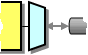
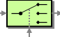
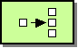
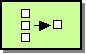
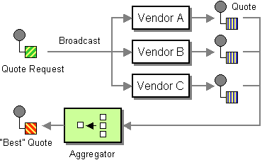
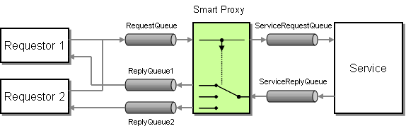

# EIP

Implementing Enterprise Integration Patterns with UT

## [Messaging Systems](https://www.enterpriseintegrationpatterns.com/patterns/messaging/MessagingComponentsIntro.html)

### [Message channel](https://www.enterpriseintegrationpatterns.com/patterns/messaging/MessageChannel.html)


Within `UT`, ports are the equivalent of channels.
The script port is usually the place where EIP patterns
are often implemented.

Use `ut-function.dispatch` to easily create a script port:

```js
module.exports = function({
    import: {
        // list of external message handlers
    }
}) {
    return require('ut-function.dispatch')({
        namespace: 'channel1', // name of the channel
        methods: { // define message handlers here
            async 'channel1.a.b'() {}
            async 'channel1.c.d'() {}
        }
    })(...arguments);
};
```

### [Message](https://www.enterpriseintegrationpatterns.com/patterns/messaging/Message.html)


Messages in UT are the arguments of message handlers and result
returned from these handlers.
Usually there are two arguments, first being the
main message, and second being some metadata.
In case of more than two arguments, the last one is
always the metadata.

Handlers usually return a result and in some cases they
can modify the metadata object as per the needs.

### [Pipes and Filters](https://www.enterpriseintegrationpatterns.com/patterns/messaging/PipesAndFilters.html)


Message processing can be split over several ports.
Each port can send a message to next one
by calling a message handler. The message handlers of
the other ports can be accessed by by destructuring
the `import` property.

Send messages to other channels / ports by calling
imported handlers, which are async functions:

```js
module.exports = function({
    import: {
        'subject.object.predicate': method1,
        subjectObjectPredicate // same method as above
    }
}) {
    const handlers = {
        async 'channel1.message.send'(...params) {
            await method1(...params);
            await subjectObjectPredicate(...params); // same as above
        }
    };

    return require('ut-function.dispatch')({
        namespace: 'channel1',
        methods: handlers
    })(...arguments);
};
```

### [Message Router](https://www.enterpriseintegrationpatterns.com/patterns/messaging/MessageRouter.html)


### [Message Translator](https://www.enterpriseintegrationpatterns.com/patterns/messaging/MessageTranslator.html)


### [Message Endpoint](https://www.enterpriseintegrationpatterns.com/patterns/messaging/MessageEndpoint.html)


## [Messaging Channels](https://www.enterpriseintegrationpatterns.com/patterns/messaging/MessagingChannelsIntro.html)

### [Point-to-Point Channel](https://www.enterpriseintegrationpatterns.com/patterns/messaging/PointToPointChannel.html)


### [Publish-Subscribe Channel](https://www.enterpriseintegrationpatterns.com/patterns/messaging/PublishSubscribeChannel.html)

### [Datatype Channel](https://www.enterpriseintegrationpatterns.com/patterns/messaging/DatatypeChannel.html)

### [Invalid Message Channel](https://www.enterpriseintegrationpatterns.com/patterns/messaging/InvalidMessageChannel.html)

### [Dead Letter Channel](https://www.enterpriseintegrationpatterns.com/patterns/messaging/DeadLetterChannel.html)


### [Guaranteed Delivery](https://www.enterpriseintegrationpatterns.com/patterns/messaging/GuaranteedMessaging.html)


### [Channel Adapter](https://www.enterpriseintegrationpatterns.com/patterns/messaging/ChannelAdapter.html)



### [Messaging Bridge](https://www.enterpriseintegrationpatterns.com/patterns/messaging/MessagingBridge.html)


### [Message Bus](https://www.enterpriseintegrationpatterns.com/patterns/messaging/MessageBus.html)


## [Message Construction](https://www.enterpriseintegrationpatterns.com/patterns/messaging/MessageConstructionIntro.html)

### [Command Message](https://www.enterpriseintegrationpatterns.com/patterns/messaging/CommandMessage.html)

### [Document Message](https://www.enterpriseintegrationpatterns.com/patterns/messaging/DocumentMessage.html)

### [Event Message](https://www.enterpriseintegrationpatterns.com/patterns/messaging/EventMessage.html)


### [Request-Reply](https://www.enterpriseintegrationpatterns.com/patterns/messaging/RequestReply.html)


The result of the message handlers is returned to the
calling port.

```js
module.exports = function() {
    const handlers = {
        async 'subject.object.predicate'(...params) {
            return {result: true}; // returned in the calling port
        }
    };

    return require('ut-function.dispatch')({
        namespace: 'subject',
        methods: handlers
    })(...arguments);
}
```

### [Return address](https://www.enterpriseintegrationpatterns.com/patterns/messaging/ReturnAddress.html)


UT implements the request reply pattern, where
the return address is the calling port by default.

### [Correlation Identifier](https://www.enterpriseintegrationpatterns.com/patterns/messaging/CorrelationIdentifier.html)


### [Message Sequence](https://www.enterpriseintegrationpatterns.com/patterns/messaging/MessageSequence.html)

### [Message Expiration](https://www.enterpriseintegrationpatterns.com/patterns/messaging/MessageExpiration.html)


### [Format Indicator](https://www.enterpriseintegrationpatterns.com/patterns/messaging/FormatIndicator.html)

## [Message Routing](https://www.enterpriseintegrationpatterns.com/patterns/messaging/MessageRoutingIntro.html)

### [Content Based Router](https://www.enterpriseintegrationpatterns.com/patterns/messaging/ContentBasedRouter.html)


```js
module.exports = function({
    import: {
        subjectObjectPredicate1,
        subjectObjectPredicate2
    }
}) {
    const handlers = {
        'channel1.message.route'({destination}) {
            return {
                case1: subjectObjectPredicate1,
                case2: subjectObjectPredicate2
            }[destination](...arguments);
        }
    };

    // return script port exposing the handlers
};
```

### [Dynamic Router](https://www.enterpriseintegrationpatterns.com/patterns/messaging/DynamicRouter.html)



```js
module.exports = function({import: external}) {
    const handlers = {
        'channel1.message.dynamicRoute'({destination}) {
            return external[destination](...arguments);
        }
    };

    // return script port exposing the handlers
};
```

### [Filter](https://www.enterpriseintegrationpatterns.com/patterns/messaging/Filter.html)


```js
const handlers = {
    'channel1.message.filter'({condition}) {
        return condition && subjectObjectPredicate(...arguments)
    }
};
```

### [Recipient List](https://www.enterpriseintegrationpatterns.com/patterns/messaging/RecipientList.html)


```js
module.exports = function({import: external}) {
    const recipients = [
        'subjectObjectPredicate1',
        'subjectObjectPredicate2'
    ];
    const handlers = {
        'channel1.message.sendParallel'() {
            return Promise.all(recipients.map(
                recipient => external[recipient](...arguments)
            ));
        },
        async 'channel1.message.sendSequential'() {
            const result = [];
            for (const recipient of recipients) {
                result.push(
                    await external[recipient](...arguments)
                );
            }
            return result;
        },
    };

    // return script port exposing the handlers
};
```

### [Splitter](https://www.enterpriseintegrationpatterns.com/patterns/messaging/Sequencer.html)



```js
const handlers = {
    'channel1.message.splitParallel': ({items}, ...rest) =>
        Promise.all(items.map(
            item => subjectObjectPredicate(item, ...rest)
        )),
    async 'channel1.message.splitSequential'({items}, ...rest) {
        const result = [];
        for (const item of items) {
            result.push(
                await subjectObjectPredicate(item, ...rest)
            );
        }
        return result;
    }
};
```

### [Aggregator](https://www.enterpriseintegrationpatterns.com/patterns/messaging/Aggregator.html)



```js
const batchStrategy = (size, list = []) => ({
    aggregate: message => list.push(message) || list,
    complete: () => (list.size >= size) && list.splice(0, list.size)
});

const handlers = (strategy => ({
    'channel1.message.aggregate'(message, ...rest) {
        strategy.aggregate(message);
        const aggregate = strategy.complete();
        return aggregate && subjectObjectPredicate(aggregate, ...rest);
    }
}))(batchStrategy(10));
```

### [Resequencer](https://www.enterpriseintegrationpatterns.com/patterns/messaging/Resequencer.html)


```js
const reSequence = (size, comparator, list = []) => ({
    aggregate: message => list.push(message) || list,
    complete: () => (list.size >= size) &&
        list
            .splice(0, list.size)
            .sort(comparator || ((first, second) => first[0].order - second[0].order))
});

const handlers = (strategy => ({
    async 'channel1.message.reSequence'(...params) {
        strategy.aggregate(...params);
        const aggregate = strategy.complete() || [];
        const result = [];
        for (const item of aggregate) {
            result.push(await subjectObjectPredicate(...item));
        }
        return result;
    }
}))(reSequence(10));
```

### [Composer](https://www.enterpriseintegrationpatterns.com/patterns/messaging/DistributionAggregate.html)


```js
const handlers = {
    'channel1.message.compose': async({part1, part2}, ...rest) => ({
        ...await subjectObjectPredicate1(part1, ...rest),
        ...await subjectObjectPredicate2(part2, ...rest)
    })
};
```

### [Scatter Gatherer](https://www.enterpriseintegrationpatterns.com/patterns/messaging/BroadcastAggregate.html)



```js
module.exports = function({import: external}) {
    const handlers = {
        async 'channel1.message.scatter'({destinations, ...params}, ...rest) {
            const result = [];
            for (const destination of destinations) {
                result.push(
                    await external[destination](params, ...rest)
                );
            }
        }
    };

    // return script port exposing the handlers
};
```

### [Routing slip](https://www.enterpriseintegrationpatterns.com/patterns/messaging/RoutingTable.html)


### [Process manager](https://www.enterpriseintegrationpatterns.com/patterns/messaging/ProcessManager.html)


### [Message broker](https://www.enterpriseintegrationpatterns.com/patterns/messaging/MessageBroker.html)


### Throttler

### Sampler

### Delayer

### Load Balancer

### Circuit Breaker

### Service Call

### Saga

### Multi-cast

### Loop

## [Message Transformation](https://www.enterpriseintegrationpatterns.com/patterns/messaging/MessageTransformationIntro.html)

### [Envelope Wrapper](https://www.enterpriseintegrationpatterns.com/patterns/messaging/EnvelopeWrapper.html)


```js
const crypto = require('crypto');
const handlers = {
    'channel1.message.wrap': async () =>
        Buffer.from(
            await subjectObjectPredicate({
                payload: crypto.randomBytes(100).toString('base64')
            }),
            'base64'
        )
    }
};
```

### [Content Enricher](https://www.enterpriseintegrationpatterns.com/patterns/messaging/DataEnricher.html)


```js
module.exports = function({import: {subjectObjectPredicate}}) {
    let enrich; // cache the enrichment data
    return require('ut-function.dispatch')({
        namespace: 'channel1',
        methods: {
            async start() {
                enrich = await subjectObjectPredicate();
            },
            'channel1.message.enrich': async(params, ...rest) =>
                subjectObjectPredicate1(
                    {params, ...enrich},
                    ...rest
                ),
            'channel1.message.enrichConfig'(params, ...rest) {
                return subjectObjectPredicate1(
                    {params, ...this.config.enrich},
                    ...rest
                );
            }
        }
    })(...arguments);
};
```

### [Content Filter](https://www.enterpriseintegrationpatterns.com/patterns/messaging/ContentFilter.html)


```js
const handlers = {
    'channel1.message.simplify': ({skip, ...simple}, ...rest) =>
        subjectObjectPredicate1(simple, ...rest)
};
```

### [Claim Check](https://www.enterpriseintegrationpatterns.com/patterns/messaging/StoreInLibrary.html)


```js
const handlers = {
    async 'channel1.message.simplify'(params, ...rest) {
        const {id} = await subjectObjectPredicate1(...arguments)
        return subjectObjectPredicate1({id}, ...rest);
    }
};
```

### [Normalizer](https://www.enterpriseintegrationpatterns.com/patterns/messaging/Normalizer.html)


```js
const detectFormat = params => params.format || 'default';
const formats = {
    format1: params => ({payload: params}),
    format2: params => ({payload: params.body}),
    default: params => params
};

const handlers = {
    'channel1.message.simplify': (params, ...rest) =>
        subjectObjectPredicate(
            formats[detectFormat(params)](params),
            ...rest
        )
};
```

### [Canonical data model](https://www.enterpriseintegrationpatterns.com/patterns/messaging/CanonicalDataModel.html)

```js
const joi = require ('joi');
module.exports = function validation() {
    return {
        'channel1.message.filter': () => {
            description: 'Message filter EIP',
            params: joi.object().keys({
                condition: joi
                    .boolean()
                    .required()
                    .description('Filtering condition')
            }),
            result: joi.object()

        }
    }
}
```

## [Messaging endpoints](https://www.enterpriseintegrationpatterns.com/patterns/messaging/MessagingEndpointsIntro.html)

### [Messaging Gateway](https://www.enterpriseintegrationpatterns.com/patterns/messaging/MessagingGateway.html)


### [Message Mapper](https://www.enterpriseintegrationpatterns.com/patterns/messaging/MessagingMapper.html)

### [Transactional Client](https://www.enterpriseintegrationpatterns.com/patterns/messaging/TransactionalClient.html)


### [Polling Consumer](https://www.enterpriseintegrationpatterns.com/patterns/messaging/PollingConsumer.html)


### [Event Driven Consumer](https://www.enterpriseintegrationpatterns.com/patterns/messaging/EventDrivenConsumer.html)


### [Competing Consumers](https://www.enterpriseintegrationpatterns.com/patterns/messaging/CompetingConsumers.html)


### [Message Dispatcher](https://www.enterpriseintegrationpatterns.com/patterns/messaging/MessageDispatcher.html)


### [Selective Consumer](https://www.enterpriseintegrationpatterns.com/patterns/messaging/MessageSelector.html)


### [Durable Subscriber](https://www.enterpriseintegrationpatterns.com/patterns/messaging/DurableSubscription.html)


### [Idempotent Receiver](https://www.enterpriseintegrationpatterns.com/patterns/messaging/IdempotentReceiver.html)

### [Service Activator](https://www.enterpriseintegrationpatterns.com/patterns/messaging/MessagingAdapter.html)


## [System Management](https://www.enterpriseintegrationpatterns.com/patterns/messaging/SystemManagementIntro.html)

### [Control Bus](https://www.enterpriseintegrationpatterns.com/patterns/messaging/ControlBus.html)


### [Detour](https://www.enterpriseintegrationpatterns.com/patterns/messaging/Detour.html)


### [Wire Tap](https://www.enterpriseintegrationpatterns.com/patterns/messaging/WireTap.html)


### [Message History](https://www.enterpriseintegrationpatterns.com/patterns/messaging/MessageHistory.html)


### [Message Store](https://www.enterpriseintegrationpatterns.com/patterns/messaging/MessageStore.html)


### [Smart Proxy](https://www.enterpriseintegrationpatterns.com/patterns/messaging/SmartProxy.html)



### [Test Message](https://www.enterpriseintegrationpatterns.com/patterns/messaging/TestMessage.html)


### [Channel Purger](https://www.enterpriseintegrationpatterns.com/patterns/messaging/ChannelPurger.html)


